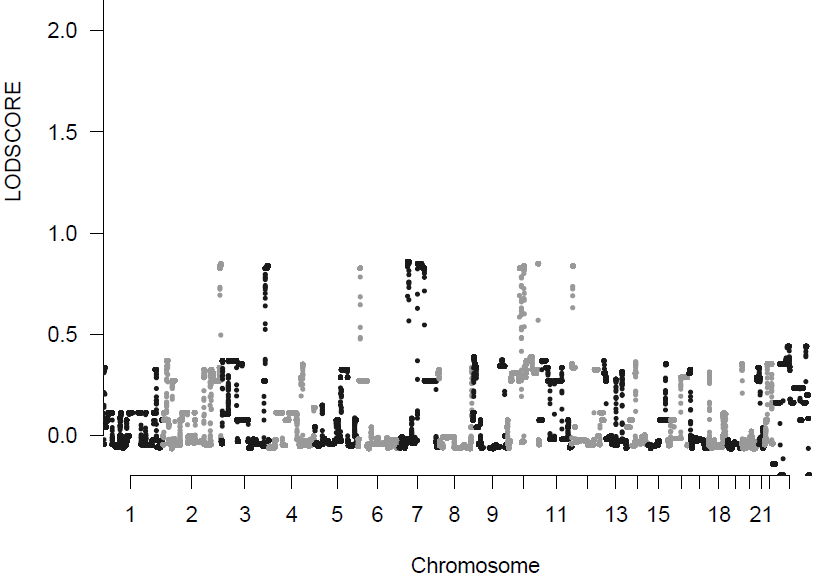

# genetic_linkage <a href=""></a>

<br />

<!-- badges: start -->

[](https://www.rdocumentation.org/trends)
[](https://opensource.org/licenses/MITgpl-3-0)

<!-- badges: end -->

<br />


| Usage | Requirement |
| :--- | :--- |
| [](https://www.nextflow.io/) | [](https://github.com/nextflow-io/nextflow) |
| | [](https://github.com/apptainer/apptainer) |
| | [](https://www.graphviz.org/download/) |

<br /><br />
## TABLE OF CONTENTS


   - [AIM](#aim)
   - [WARNINGS](#warnings)
   - [CONTENT](#content)
   - [INPUT](#input)
   - [HOW TO RUN](#how-to-run)
   - [OUTPUT](#output)
   - [VERSIONS](#versions)
   - [LICENCE](#licence)
   - [CITATION](#citation)
   - [CREDITS](#credits)
   - [ACKNOWLEDGEMENTS](#Acknowledgements)
   - [WHAT'S NEW IN](#what's-new-in)

<br /><br />
## AIM

- Basic quality control of initial file structures (genotypes, pedigree information, SNP allele frequencies and SNP positions on human reference genome).
- Quality control analysis and file preparation by the [Alohomora](https://doi.org/10.1093/bioinformatics/bti264) and [Merlin](https://csg.sph.umich.edu/abecasis/Merlin/tour/linkage.html) softwares (gender check, filiation check, removal of uninformative SNPs and SNPs with Mendelian errors).
- Linkage and information analysis by the [Merlin](https://csg.sph.umich.edu/abecasis/Merlin/tour/linkage.html) software. See the tutorial and other info [here](https://csg.sph.umich.edu/abecasis/Merlin/tour/linkage.html)

<br /><br />
## WARNINGS

The script does not perform any filtering regarding call rate, standard deviation of the log R ratio (LRR) and B allele frequency (BAF) of the SNP. Please, contact me if you need my R script to do that.

<br /><br />
## CONTENT
<br />

| Files and folder | Description |
| :--- | :--- |
| **main.nf** | File that can be executed using a linux terminal, a MacOS terminal or Windows 10 WSL2. |
| **nextflow.config** | Parameter settings for the *main.nf* file. Users have to open this file, set the desired settings and save these modifications before execution. |
| **bin folder** | Contains files required by the *main.nf* file. |
| **Licence.txt** | Licence of the release. |

<br /><br />
## INPUT
<br />

| Required files |
| :--- |
| A genotype file. |
| An allelic frequency file. |
| A map file. BEWARE: no space allowed in the Header. |
| A pedigree file. |
| A pedigree file. |

See the Alohomora_Format.doc in https://gmc.mdc-berlin.de/alohomora/docs.zip

<br />

The dataset used in the *nextflow.config* file, as example, is available at https://zenodo.org/records/10689924.

<br />

| File name | Description |
| :--- | :--- |
| **genotype.tsv** | Genotype file. Available [here](https://zenodo.org/records/10689924/files/genotype.tsv). |
| **freq_NFE_hg19.txt** | Allelic frequency file. Available [here](https://zenodo.org/records/10689924/files/freq_NFE_hg19.txt). |
| **map_hg19.txt** | Map file. Available [here](https://zenodo.org/records/10689924/files/map_hg19.txt). |
| **pedigree.txt** | Pedigree file. Available [here](https://zenodo.org/records/10689924/files/pedigree.txt). |
| **hg19_grch37p5_chr_size_cumul.txt** | Coordinates of the hg19_grch37p5 Human Genome for plots. Available [here](https://zenodo.org/records/10689924/files/hg19_grch37p5_chr_size_cumul.txt). |


<br /><br />
## HOW TO RUN

### 1. Prerequisite

Installation of:<br />
[nextflow DSL2](https://gael-millot.github.io/protocols/docs/Protocol%20152-rev0%20DSL2.html#_Toc159933761)<br />
[Graphviz](https://www.graphviz.org/download/), `sudo apt install graphviz` for Linux ubuntu<br />
[Apptainer](https://gael-millot.github.io/protocols/docs/Protocol%20135-rev0%20APPTAINER.html#_Toc160091693)<br />


### 2. Local running (personal computer)


####	2.1. *main.nf* file in the personal computer

- Mount a server if required:

```
DRIVE="Z" # change the letter to fit the correct drive
sudo mkdir /mnt/share
sudo mount -t drvfs $DRIVE: /mnt/share
```

Warning: if no mounting, it is possible that nextflow does nothing, or displays a message like:
<pre>
Launching `main.nf` [loving_morse] - revision: d5aabe528b
/mnt/share/Users
</pre>

- Run the following command from where the *main.nf* and *nextflow.config* files are (example: \\wsl$\Ubuntu-20.04\home\gael):

```
nextflow run main.nf -c nextflow.config
```

with -c to specify the name of the config file used.


#### 2.2.	*main.nf* file in the public git repository

Run the following command from where you want the results:

```
nextflow run gael-millot/genetic_linkage # github, or nextflow run http://github.com/gael-millot/genetic_linkage
nextflow run -hub pasteur gmillot/genetic_linkage -r v1.0.0 # gitlab
```


### 3. Distant running (example with the Pasteur cluster)

####	3.1. Pre-execution

Copy-paste this after having modified the EXEC_PATH variable:

```
EXEC_PATH="/pasteur/zeus/projets/p01/BioIT/gmillot/genetic_linkage" # where the bin folder of the main.nf script is located
export CONF_BEFORE=/opt/gensoft/exe # on maestro

export JAVA_CONF=java/13.0.2
export JAVA_CONF_AFTER=bin/java # on maestro
export APP_CONF=apptainer/1.2.3
export APP_CONF_AFTER=bin/apptainer # on maestro
export GIT_CONF=git/2.39.1
export GIT_CONF_AFTER=bin/git # on maestro
export GRAPHVIZ_CONF=graphviz/2.42.3
export GRAPHVIZ_CONF_AFTER=bin/graphviz # on maestro

MODULES="${CONF_BEFORE}/${JAVA_CONF}/${JAVA_CONF_AFTER},${CONF_BEFORE}/${APP_CONF}/${APP_CONF_AFTER},${CONF_BEFORE}/${GIT_CONF}/${GIT_CONF_AFTER}/${GRAPHVIZ_CONF}/${GRAPHVIZ_CONF_AFTER}"
cd ${EXEC_PATH}
chmod 755 ${EXEC_PATH}/bin/*.*
module load ${JAVA_CONF} ${APP_CONF} ${GIT_CONF} ${GRAPHVIZ_CONF}
```


####	3.2. *main.nf* file in a cluster folder

Modify the second line of the code below, and run from where the *main.nf* and *nextflow.config* files are (which has been set thanks to the EXEC_PATH variable above):

```
HOME_INI=$HOME
HOME="${ZEUSHOME}/genetic_linkage/" # $HOME changed to allow the creation of .nextflow into /$ZEUSHOME/genetic_linkage/, for instance. See NFX_HOME in the nextflow software script
trap '' SIGINT
nextflow run --modules ${MODULES} main.nf -c nextflow.config
HOME=$HOME_INI
trap SIGINT
```


####	3.3. *main.nf* file in the public git repository

Modify the first and third lines of the code below, and run (results will be where the EXEC_PATH variable has been set above):

```
VERSION="v1.0"
HOME_INI=$HOME
HOME="${ZEUSHOME}/genetic_linkage/" # $HOME changed to allow the creation of .nextflow into /$ZEUSHOME/genetic_linkage/, for instance. See NFX_HOME in the nextflow software script
trap '' SIGINT
nextflow run --modules ${MODULES} gael-millot/genetic_linkage -r $VERSION -c $HOME/nextflow.config #github, or nextflow run --modules ${MODULES} http://github.com/gael-millot/genetic_linkage -r $VERSION -c $HOME/nextflow.config
nextflow run --modules ${MODULES} -hub pasteur gmillot/genetic_linkage -r $VERSION -c $HOME/nextflow.config # gitlab
HOME=$HOME_INI
trap SIGINT
```


### 4. Error messages and solutions

####	Message 1
<pre>
Unknown error accessing project `gmillot/genetic_linkage` -- Repository may be corrupted: /pasteur/sonic/homes/gmillot/.nextflow/assets/gmillot/genetic_linkage
</pre>

Purge using:
```
rm -rf /pasteur/sonic/homes/gmillot/.nextflow/assets/gmillot*
```

####	Message 2
<pre>
WARN: Cannot read project manifest -- Cause: Remote resource not found: https://gitlab.pasteur.fr/api/v4/projects/gmillot%2Fgenetic_linkage
</pre>

Contact Gael Millot (distant repository is not public).

####	Message 3
<pre>
permission denied
</pre>

Use chmod to change the user rights. Example linked to files in the bin folder: 
```
chmod 755 bin/*.*
```


<br /><br />
## OUTPUT

An example of results is present at this address: https://zenodo.org/records/10689924/files/linkage_analysis_1708550143.zip

Description:

| Result folder | Description |
| :--- | :--- |
| **reports** | Folder containing the classical reports of nextflow including the *nextflow.config* file used. |
| **merlin_reports** | Folder containing all the reports of the different processes. |
| **Group\<GR NB\>c\<CHR NB\>_merlin** | Folder containing the information provided by Merlin for each group of patients and for each chromosome. |
| **complete_lodscore.tsv** | Whole Genome Lodscore. |
| **cutoff\<CUTOFF NB\>complete_lodscore.tsv** | Optional file containing the lines of the *complete_lodscore.tsv* file above a Lodscore threshold defined in the nextflow.config file. |
| **lodscore_whole_genome.pdf** | Plot of the Lodscores (both whole genome and per chromosome). Model used is indicated in the title, as well as some user settings (chr nb and lodscore cut-offs, separated by pipes). |
| **lodscore_settings.pdf** | Plot of the *cutoff\*complete_lodscore.tsv* files. |
| **complete_information.tsv** | Information of each SNP for each group of patients. |
| **infor_whole_genome.pdf** | Plot of the *complete_information.tsv* files. |
| **pedstats.markerinfo_c\<CHR NB\>** | Marker genotype statistics (one file per chromosome). |
| **pedstats_c\<CHR NB\>.pdf** | Summary of family structure (one file per chromosome). |
| **raw_snp.freq.absent.in.map.txt** | raw snp in the freq file but absent in the map file. |
| **raw_snp.genotype.absent.in.freq.txt** | raw snp in the genotype file but absent in the freq file. |
| **raw_snp.genotype.absent.in.map.txt** | raw snp in the genotype file but absent in the map file. |
| **raw_snp.map.absent.in.freq.txt** | raw snp in the map file but absent in the freq file. |
| **raw_snp.not.geno.atall.in.genotype** | raw snp not genotyped in any of the indiv in the genotype file. |
| **lod_data.RData** | R file of the data used to generate the *lodscore_whole_genome.pdf* file. |
| **info_data.RData** | R file of the data used to generate the *infor_whole_genome.pdf* file. |


<br /><br />
## VERSIONS


The different releases are tagged [here](https://github.com/gael-millot/genetic_linkage/tags).

<br /><br />
## LICENCE


This package of scripts can be redistributed and/or modified under the terms of the GNU General Public License as published by the Free Software Foundation, either version 3 of the License, or (at your option) any later version.
Distributed in the hope that it will be useful, but without any warranty; without even the implied warranty of merchandability or fitness for a particular purpose.
See the GNU General Public License for more details at https://www.gnu.org/licenses or in the Licence.txt attached file.

<br /><br />
## CITATION


Not yet published.


<br /><br />
## CREDITS


Alexandre Mathieu, GHFC team, Institut Pasteur, Paris

Eric Deveaud, HPC Core Facility, Institut Pasteur, Paris

[Gael A. Millot](https://github.com/gael-millot), Hub, Institut Pasteur, Paris, France

<br /><br />
## ACKNOWLEDGEMENTS


The developers & maintainers of the mentioned softwares and packages, including:

- [R](https://www.r-project.org/)
- [ggplot2](https://ggplot2.tidyverse.org/)
- [Nextflow](https://www.nextflow.io/)
- [Apptainer](https://apptainer.org/)
- [Docker](https://www.docker.com/)
- [Git](https://git-scm.com/)
- [Github](https://github.com/)
- [Gitlab](https://about.gitlab.com/)
- [Bash](https://www.gnu.org/software/bash/)
- [Ubuntu](https://ubuntu.com/)

Special acknowledgement to:

- [Goncalo Abecasis et al.](https://genome.sph.umich.edu/wiki/Abecasis_Lab) for the release of [Merlin](https://csg.sph.umich.edu/abecasis/Merlin/tour/linkage.html) and [Pedstats](http://csg.sph.umich.edu/abecasis/Pedstats/). 
- Franz Rüschendorf et al. for the release of [Alohomora](https://doi.org/10.1093/bioinformatics/bti264).


<br /><br />
## WHAT'S NEW IN

#### v3.5

- In the nextflow.config file, upgrade singularity -> apptainer.


#### v3.4

- Transfert into github
- Zenodo url added in nextflow.config


#### v3.3

Haplotype added.


#### v3.2

- Model option --npl --exp added
- New simple dataset


#### v3.1

Bug fixed in clean_lod_gael.R


#### v3.0

- Code improved so that splitting is checked for all parents present in split pedigrees at the first step of nextflow
- README improved: now dataset and results are in zenodo


#### v2.9

code debugged


#### v2.8

code much improved so that controls are reinforced. Non parametric analysis is back again


#### v2.7

code improved so that chr can be missing


#### v2.6

code improved so that any error in R subprocess should stop nextflow execution


#### v2.5

code improved and debugged (error not anymore piped into tee notably)


#### v2.4

Bug solved in the R_main_functions_gael_20180123.R file


#### v2.3

Empty channel solved


#### v2.2

pdf debugged and .Rdata returned, for making nice graphs thenafter


#### v2.1

Small improve of main.nf file + README file


#### v2.0

Pipeline ok. The checking process output has to be debugged (a few error messages) but not critical for the analysis


#### v1.0

Pipeline ok but lack the information assembly and the checking part has to be debugged


